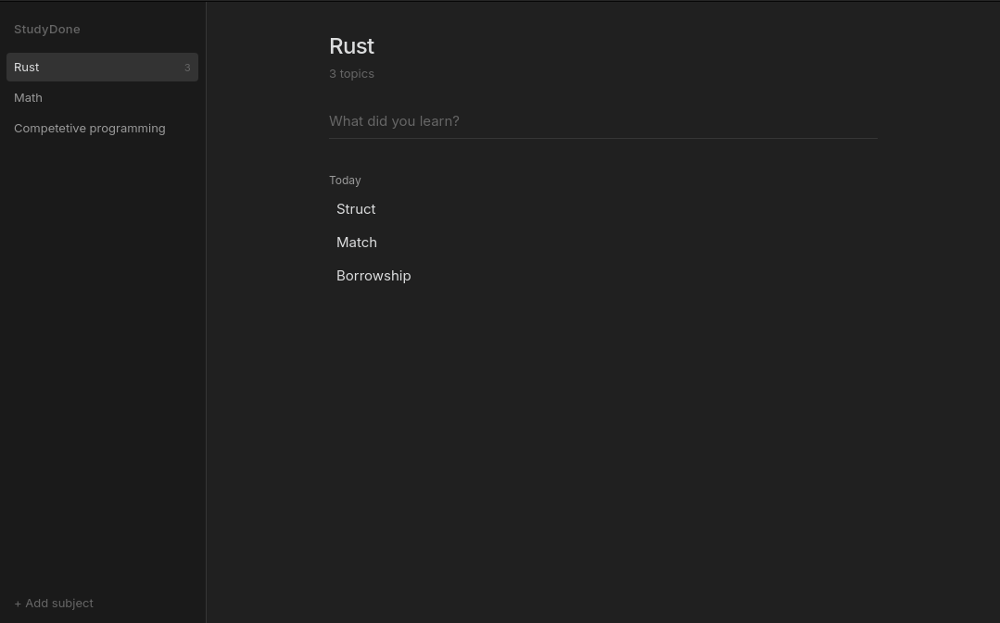

# StudyDone

A small desktop app to log what you learned, by subject.

Pick a subject, type what you covered, press Enter. Entries are grouped by day.

<br>



<br>

## Download

Latest builds: **[Releases](https://github.com/cdmorozov/studydone/releases/latest)**

<br>

| File | For |
| --- | --- |
| `StudyDone_*.deb` | Ubuntu, Debian, Mint |
| `StudyDone-*.rpm` | Fedora, RHEL, openSUSE |
| `StudyDone_*.AppImage` | Any Linux |

<br>

```bash
# Ubuntu / Debian
sudo apt install ./StudyDone_0.1.0_amd64.deb

# Fedora
sudo dnf install ./StudyDone-0.1.0-1.x86_64.rpm

# AppImage
chmod +x StudyDone_0.1.0_amd64.AppImage
./StudyDone_0.1.0_amd64.AppImage
```

<br>

AppImage is larger (~100 MB) because it ships WebKit. The `.rpm` / `.deb` are ~5 MB and use the system WebKit.

<br>

## Develop

```bash
bun install
bun tauri dev
```

<br>

```bash
bun tauri build
```
